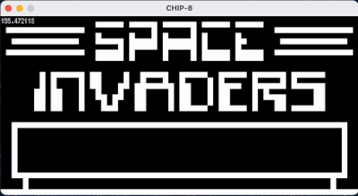

# `ebiten8`

A CHIP-8 emulator written with Go and [Ebiten](https://github.com/hajimehoshi/ebiten). (WIP)

## Credits

* ROMs: https://github.com/mir3z/chip8-emu/tree/master/roms
* Sound: https://www.soundjay.com/beep-sounds-1.html#google_vignette
* Font: https://github.com/hajimehoshi/ebiten/tree/main/examples/resources/fonts
